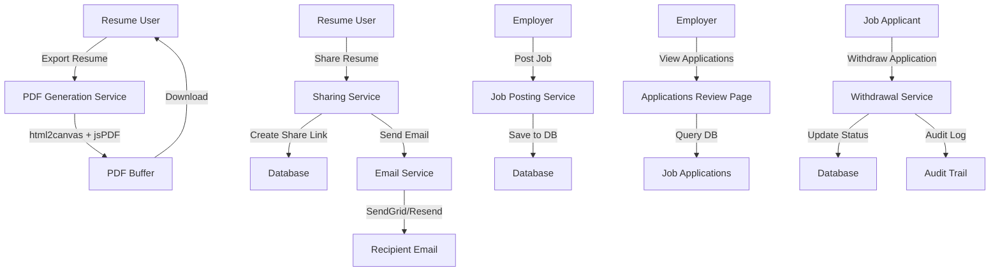

# Design Document: Critical App Features Fix

## Overview

This design addresses five critical issues in the Finbers Link application that are blocking core user workflows. The fixes involve implementing actual PDF generation for resume exports, sending emails for resume sharing, creating the employer applications review interface, separating job posting from admin interface, and implementing application withdrawal functionality. These are partially implemented features with TODO comments that need completion.

## Architecture



## Components and Interfaces

### 1. PDF Generation Service

**Purpose**: Generate actual PDF files from resume HTML using html2canvas and jsPDF

**Current State**: Returns empty buffer as placeholder

**Interface**:
```typescript
interface PDFGenerationService {
  generatePDF(
    resumeId: string,
    template: PDFTemplate,
    options?: ExportOptions
  ): Promise<Buffer>
  
  htmlToPdf(html: string, template: PDFTemplate): Promise<Buffer>
}
```

**Key Changes**:
- Replace placeholder implementation with actual html2canvas + jsPDF conversion
- Handle image rendering (headshots, embedded content)
- Support multiple resume templates (Modern, Classic, Minimal)
- Generate proper PDF metadata (title, author, creation date)

### 2. Email Sharing Service

**Purpose**: Send resume share links to recipients via email

**Current State**: Share links created but emails never sent (TODO comment)

**Interface**:
```typescript
interface SharingService {
  createShareLink(
    resumeId: string,
    userId: string,
    recipients: string[],
    expirationDays?: number
  ): Promise<ShareLink[]>
  
  sendShareInvitationEmail(
    shareLink: ShareLink,
    recipientEmail: string,
    senderName: string,
    message?: string
  ): Promise<void>
}
```

**Key Changes**:
- Implement email sending after share link creation
- Use existing SendGrid/Resend infrastructure
- Include share link in email body with expiration info
- Track email delivery status

### 3. Employer Applications Review Interface

**Purpose**: Allow employers to review applications for their posted jobs

**Current State**: Route `/employer/applications` doesn't exist

**Interface**:
```typescript
interface EmployerApplicationsPage {
  getApplicationsForEmployer(
    employerId: string,
    filters?: ApplicationFilters
  ): Promise<ApplicationWithDetails[]>
  
  updateApplicationStatus(
    applicationId: string,
    status: JobApplicationStatus
  ): Promise<void>
}
```

**Key Changes**:
- Create `/app/employer/applications/page.tsx`
- Query applications for jobs posted by employer
- Display applications with candidate info, resume, cover letter
- Allow status updates (SUBMITTED → IN_REVIEW → INTERVIEW → OFFERED/REJECTED)
- Show application timeline and notes

### 4. Employer Job Posting Workflow

**Purpose**: Separate employer job posting from admin interface

**Current State**: `/jobs/post` redirects to `/admin/jobs`

**Interface**:
```typescript
interface EmployerJobPosting {
  createJobPosting(
    employerId: string,
    jobData: CreateJobInput
  ): Promise<JobOpportunity>
  
  updateJobPosting(
    jobId: string,
    employerId: string,
    jobData: UpdateJobInput
  ): Promise<JobOpportunity>
}
```

**Key Changes**:
- Create `/app/employer/jobs/new/page.tsx` for job posting form
- Create `/app/employer/jobs/[jobId]/edit/page.tsx` for editing
- Reuse job posting form component from admin interface
- Ensure employer can only manage their own jobs
- Redirect `/jobs/post` to `/employer/jobs/new`

### 5. Application Withdrawal Service

**Purpose**: Allow applicants to withdraw job applications

**Current State**: Button exists but no backend implementation

**Interface**:
```typescript
interface ApplicationWithdrawalService {
  withdrawApplication(
    applicationId: string,
    userId: string,
    reason?: string
  ): Promise<void>
  
  recordWithdrawalAudit(
    applicationId: string,
    userId: string,
    reason?: string
  ): Promise<void>
}
```

**Key Changes**:
- Implement withdrawal endpoint: `DELETE /api/applications/{applicationId}`
- Update application status to WITHDRAWN
- Create audit log entry
- Notify employer of withdrawal
- Only allow withdrawal if status is SUBMITTED

## Data Models

### ResumeShareLink (Existing)
```typescript
model ResumeShareLink {
  id                String    @id @default(cuid())
  resumeId          String
  token             String    @unique
  recipientEmail    String
  sentBy            String
  expiresAt         DateTime
  viewCount         Int       @default(0)
  lastViewedAt      DateTime?
  createdAt         DateTime  @default(now())
  updatedAt         DateTime  @updatedAt
  resume            Resume    @relation(fields: [resumeId], references: [id])
  sentByUser        User      @relation(fields: [sentBy], references: [id])
}
```

### JobApplication (Existing - needs status update)
```typescript
model JobApplication {
  id               String               @id @default(cuid())
  userId           String
  jobOpportunityId String
  resumeId         String?
  status           JobApplicationStatus @default(SUBMITTED)
  // Add new fields:
  withdrawnAt      DateTime?
  withdrawalReason String?
  submittedAt      DateTime             @default(now())
  updatedAt        DateTime             @updatedAt
  coverLetter      String?
  opportunity      JobOpportunity       @relation(fields: [jobOpportunityId], references: [id])
  resume           Resume?              @relation(fields: [resumeId], references: [id])
  user             User                 @relation(fields: [userId], references: [id])
}
```

### ApplicationAuditLog (New)
```typescript
model ApplicationAuditLog {
  id               String   @id @default(cuid())
  applicationId    String
  userId           String
  action           String   // SUBMITTED, WITHDRAWN, STATUS_CHANGED, etc.
  previousStatus   String?
  newStatus        String?
  reason           String?
  metadata         Json?
  createdAt        DateTime @default(now())
  
  application      JobApplication @relation(fields: [applicationId], references: [id])
  user             User           @relation(fields: [userId], references: [id])
}
```

## Algorithmic Pseudocode

### PDF Generation Algorithm

```pascal
ALGORITHM generateResumePDF(resumeId, template, options)
INPUT: resumeId (String), template (PDFTemplate), options (ExportOptions)
OUTPUT: pdfBuffer (Buffer)

BEGIN
  // Step 1: Fetch resume data
  resume ← database.getResume(resumeId)
  ASSERT resume IS NOT NULL
  
  // Step 2: Generate HTML from template
  html ← generateResumeHTML(resume, template, options)
  ASSERT html IS NOT NULL AND html.length > 0
  
  // Step 3: Convert HTML to canvas
  canvas ← html2canvas(html, {
    scale: 2,
    useCORS: true,
    allowTaint: true,
    backgroundColor: '#ffffff'
  })
  ASSERT canvas IS NOT NULL
  
  // Step 4: Create PDF from canvas
  pdf ← new jsPDF({
    orientation: 'portrait',
    unit: 'mm',
    format: 'a4'
  })
  
  // Step 5: Add canvas image to PDF
  imgData ← canvas.toDataURL('image/png')
  pdf.addImage(imgData, 'PNG', 0, 0, 210, 297)
  
  // Step 6: Add metadata
  pdf.setProperties({
    title: resume.title,
    author: resume.user.firstName + ' ' + resume.user.lastName,
    subject: 'Resume - ' + resume.title,
    creator: 'Finbers Link'
  })
  
  // Step 7: Generate buffer
  pdfBuffer ← pdf.output('arraybuffer')
  ASSERT pdfBuffer.byteLength > 0
  
  // Step 8: Record export
  recordExport(resumeId, 'PDF', template)
  
  RETURN pdfBuffer
END
```

**Preconditions**:
- resumeId is valid and exists in database
- template is one of: MODERN, CLASSIC, MINIMAL
- html2canvas and jsPDF libraries are available
- Resume has valid HTML structure

**Postconditions**:
- Returns non-empty PDF buffer
- PDF contains all resume content
- Export is recorded in database
- PDF metadata is properly set

### Email Sharing Algorithm

```pascal
ALGORITHM sendShareEmails(resumeId, recipients, message)
INPUT: resumeId (String), recipients (String[]), message (String)
OUTPUT: emailsSent (Integer)

BEGIN
  // Step 1: Validate inputs
  ASSERT resumeId IS NOT NULL
  ASSERT recipients.length > 0 AND recipients.length <= 50
  
  // Step 2: Fetch resume and user
  resume ← database.getResume(resumeId)
  user ← database.getUser(resume.userId)
  ASSERT resume IS NOT NULL AND user IS NOT NULL
  
  // Step 3: Initialize counter
  emailsSent ← 0
  
  // Step 4: Process each recipient
  FOR EACH email IN recipients DO
    TRY
      // Create share link
      shareLink ← createShareLink(resumeId, email)
      ASSERT shareLink IS NOT NULL
      
      // Build email content
      shareUrl ← buildShareUrl(shareLink.token)
      emailBody ← renderEmailTemplate({
        senderName: user.firstName + ' ' + user.lastName,
        resumeTitle: resume.title,
        shareUrl: shareUrl,
        expiresAt: shareLink.expiresAt,
        message: message
      })
      
      // Send email
      sendEmail({
        to: email,
        subject: user.firstName + ' shared their resume with you',
        html: emailBody,
        from: 'noreply@finbers-link.com'
      })
      
      // Update share link status
      updateShareLink(shareLink.id, { emailSentAt: now() })
      
      emailsSent ← emailsSent + 1
      
    CATCH error
      logError('Failed to send email to ' + email, error)
      // Continue with next recipient
    END TRY
  END FOR
  
  RETURN emailsSent
END
```

**Preconditions**:
- resumeId is valid and belongs to authenticated user
- recipients array contains valid email addresses
- Email service is configured (SendGrid or Resend)

**Postconditions**:
- Share links created for all recipients
- Emails sent to all valid recipients
- Share link records updated with email sent timestamp
- Errors logged but don't block other recipients

### Application Withdrawal Algorithm

```pascal
ALGORITHM withdrawApplication(applicationId, userId, reason)
INPUT: applicationId (String), userId (String), reason (String)
OUTPUT: success (Boolean)

BEGIN
  // Step 1: Fetch application
  application ← database.getJobApplication(applicationId)
  ASSERT application IS NOT NULL
  
  // Step 2: Verify ownership
  ASSERT application.userId = userId
  
  // Step 3: Check if withdrawal is allowed
  ASSERT application.status = 'SUBMITTED'
  
  // Step 4: Create audit log
  auditLog ← createAuditLog({
    applicationId: applicationId,
    userId: userId,
    action: 'WITHDRAWN',
    previousStatus: application.status,
    newStatus: 'WITHDRAWN',
    reason: reason
  })
  ASSERT auditLog IS NOT NULL
  
  // Step 5: Update application status
  application.status ← 'WITHDRAWN'
  application.withdrawnAt ← now()
  application.withdrawalReason ← reason
  database.updateJobApplication(application)
  
  // Step 6: Notify employer
  employer ← database.getUser(application.opportunity.postedById)
  sendNotification({
    userId: employer.id,
    type: 'APPLICATION_WITHDRAWN',
    data: {
      applicantName: application.user.firstName + ' ' + application.user.lastName,
      jobTitle: application.opportunity.title,
      reason: reason
    }
  })
  
  RETURN true
END
```

**Preconditions**:
- applicationId is valid and exists
- userId matches application owner
- Application status is SUBMITTED
- User is authenticated

**Postconditions**:
- Application status changed to WITHDRAWN
- Audit log created
- Employer notified
- withdrawnAt timestamp set
- withdrawalReason recorded

## Key Functions with Formal Specifications

### Function 1: generateResumePDF()

```typescript
async function generateResumePDF(
  resumeId: string,
  template: PDFTemplate,
  options?: ExportOptions
): Promise<Buffer>
```

**Preconditions**:
- `resumeId` is a valid CUID and exists in database
- `template` is one of: 'MODERN', 'CLASSIC', 'MINIMAL'
- `options.includePhoto` is boolean (optional)
- html2canvas and jsPDF are available

**Postconditions**:
- Returns Buffer with PDF content
- Buffer size > 0 (non-empty PDF)
- PDF contains all resume sections
- Export record created in database
- No side effects on resume data

**Loop Invariants**: N/A (no loops in main function)

### Function 2: sendShareInvitationEmail()

```typescript
async function sendShareInvitationEmail(
  shareLink: ShareLink,
  recipientEmail: string,
  senderName: string,
  message?: string
): Promise<void>
```

**Preconditions**:
- `shareLink` is valid and not expired
- `recipientEmail` is valid email format
- `senderName` is non-empty string
- Email service is configured

**Postconditions**:
- Email sent successfully to recipient
- Share link marked with emailSentAt timestamp
- No exceptions thrown (errors logged)
- Email contains valid share URL

**Loop Invariants**: N/A

### Function 3: withdrawApplication()

```typescript
async function withdrawApplication(
  applicationId: string,
  userId: string,
  reason?: string
): Promise<void>
```

**Preconditions**:
- `applicationId` is valid CUID
- `userId` matches application owner
- Application status is 'SUBMITTED'
- User is authenticated

**Postconditions**:
- Application status changed to 'WITHDRAWN'
- `withdrawnAt` timestamp set to current time
- `withdrawalReason` stored if provided
- Audit log entry created
- Employer notification sent
- No side effects on other applications

**Loop Invariants**: N/A

## Example Usage

### Resume PDF Export
```typescript
// User clicks "Download PDF" button
const pdfBuffer = await generateResumePDF(
  resumeId,
  'MODERN',
  { includePhoto: true }
);

// Send as download
response.setHeader('Content-Type', 'application/pdf');
response.setHeader('Content-Disposition', `attachment; filename="${filename}.pdf"`);
response.send(pdfBuffer);
```

### Resume Sharing with Email
```typescript
// User shares resume with recipients
const shareLinks = await SharingService.createShareLink(
  resumeId,
  userId,
  ['recipient1@example.com', 'recipient2@example.com'],
  7 // expires in 7 days
);

// Send emails to each recipient
for (const link of shareLinks) {
  await SharingService.sendShareInvitationEmail(
    link,
    link.recipientEmail,
    'John Doe',
    'Check out my resume!'
  );
}
```

### Employer Reviewing Applications
```typescript
// Employer navigates to /employer/applications
const applications = await getApplicationsForEmployer(employerId);

// Display applications grouped by job
// Allow status updates
await updateApplicationStatus(applicationId, 'IN_REVIEW');
```

### Job Posting by Employer
```typescript
// Employer navigates to /employer/jobs/new
// Fills out job posting form
const job = await createJobPosting(employerId, {
  title: 'Senior Developer',
  company: 'Tech Corp',
  location: 'Remote',
  description: '...',
  requirements: ['React', 'Node.js']
});
```

### Application Withdrawal
```typescript
// Applicant clicks "Withdraw" button
await withdrawApplication(
  applicationId,
  userId,
  'Found another opportunity'
);

// Application status changes to WITHDRAWN
// Employer receives notification
```

## Correctness Properties

*A property is a characteristic or behavior that should hold true across all valid executions of a system—essentially, a formal statement about what the system should do. Properties serve as the bridge between human-readable specifications and machine-verifiable correctness guarantees.*

### Property 1: PDF Generation Completeness

*For any* valid resume, generating a PDF SHALL produce a non-empty buffer containing a valid PDF structure with all resume sections.

**Validates: Requirements 1.1, 1.2, 1.6**

### Property 2: PDF Metadata Correctness

*For any* resume export operation, the generated PDF SHALL contain metadata including title, author, subject, and creation date matching the resume data.

**Validates: Requirements 1.3**

### Property 3: PDF Photo Rendering

*For any* resume with a photo and includePhoto option enabled, the generated PDF SHALL render the photo in the output.

**Validates: Requirements 1.4**

### Property 4: Share Link Creation Completeness

*For any* list of recipients, creating share links SHALL produce one unique link per recipient with valid tokens and expiration dates.

**Validates: Requirements 2.1**

### Property 5: Email Delivery Tracking

*For any* share link, sending an invitation email SHALL update the emailSentAt timestamp and include the share URL and expiration date in the email body.

**Validates: Requirements 2.2, 2.3, 2.9**

### Property 6: Share Link Expiration Enforcement

*For any* share link where the current time exceeds the expiration date, accessing the link SHALL return a 404 error and prevent resume access.

**Validates: Requirements 2.4**

### Property 7: Application Authorization

*For any* employer and job application, querying applications for that employer SHALL only return applications for jobs they posted.

**Validates: Requirements 3.1, 3.3, 9.3**

### Property 8: Application Status Persistence

*For any* application status update, the change SHALL be persisted to the database and reflected in subsequent queries.

**Validates: Requirements 3.4**

### Property 9: Audit Log Creation

*For any* application status change, an audit log entry SHALL be created recording the previous status, new status, user, and timestamp.

**Validates: Requirements 3.5, 8.1, 8.2**

### Property 10: Job Posting Authorization

*For any* employer attempting to edit a job, the system SHALL verify they own the job before allowing modifications.

**Validates: Requirements 4.3, 4.6, 9.4**

### Property 11: Job Posting Creation

*For any* valid job posting submission, the system SHALL create a new job opportunity associated with the employer's account.

**Validates: Requirements 4.2, 4.3**

### Property 12: Application Withdrawal Status Transition

*For any* application in SUBMITTED status, withdrawing it SHALL change the status to WITHDRAWN and set the withdrawnAt timestamp.

**Validates: Requirements 5.1, 5.2**

### Property 13: Withdrawal Audit Logging

*For any* application withdrawal, an audit log entry SHALL be created with action type WITHDRAWN and the withdrawal reason if provided.

**Validates: Requirements 5.2, 8.1, 8.2, 8.3**

### Property 14: Withdrawal Authorization

*For any* withdrawal request, the system SHALL verify the applicant owns the application before processing.

**Validates: Requirements 5.5, 9.5**

### Property 15: Withdrawal Status Validation

*For any* application not in SUBMITTED status, attempting to withdraw it SHALL return a 400 Bad Request error.

**Validates: Requirements 5.6**

### Property 16: Withdrawal Atomicity

*For any* application withdrawal, the status change, timestamp, and audit log creation SHALL occur atomically—all succeed or all fail together.

**Validates: Requirements 5.1, 5.2, 11.1**

### Property 17: PDF Generation Performance

*For any* resume export request, the PDF generation SHALL complete within 5 seconds.

**Validates: Requirements 1.5, 10.1**

### Property 18: Application Loading Performance

*For any* employer with typical application volume, loading the applications page SHALL complete within 2 seconds.

**Validates: Requirements 3.10, 10.2**

### Property 19: Withdrawal Processing Performance

*For any* withdrawal request, the operation SHALL complete within 1 second.

**Validates: Requirements 5.10, 10.5**

### Property 20: Resume Export Authorization

*For any* resume export request, the system SHALL verify the user owns the resume before generating the PDF.

**Validates: Requirements 1.8, 9.1**

### Property 21: Resume Sharing Authorization

*For any* resume sharing request, the system SHALL verify the user owns the resume before creating share links.

**Validates: Requirements 2.10, 9.2**

### Property 22: Email Service Resilience

*For any* email sending failure, the system SHALL retry up to 3 times with exponential backoff before logging the failure.

**Validates: Requirements 2.6, 7.3, 7.8**

### Property 23: Rate Limiting - Resume Sharing

*For any* user, sharing resumes SHALL be rate limited to 50 recipients per hour to prevent abuse.

**Validates: Requirements 2.8, 9.8**

### Property 24: Rate Limiting - PDF Export

*For any* user, PDF exports SHALL be rate limited to 5 per minute to prevent resource exhaustion.

**Validates: Requirements 9.7**

### Property 25: Data Integrity - Withdrawal Atomicity

*For any* application withdrawal, the status, timestamp, and audit log SHALL be updated atomically—if any part fails, all changes are rolled back.

**Validates: Requirements 11.1, 11.8**

### Property 26: Share Link Token Validation

*For any* share link access attempt, the system SHALL validate the token format and expiration before granting access.

**Validates: Requirements 9.9**

### Property 27: Employer Role Verification

*For any* access to /employer routes, the system SHALL verify the user has employer role before granting access.

**Validates: Requirements 9.6**

### Property 28: Resume Data Immutability

*For any* PDF export operation, the underlying resume data SHALL remain unchanged after the export completes.

**Validates: Requirements 11.3**

### Property 29: Job Posting Immutability

*For any* job posting, the employer association (postedById) SHALL be immutable after creation.

**Validates: Requirements 11.5**

### Property 30: Audit Log Immutability

*For any* audit log entry, it SHALL not be modifiable or deletable after creation.

**Validates: Requirements 11.6**

## Error Handling

### Error Scenario 1: PDF Generation Failure
**Condition**: html2canvas or jsPDF fails to generate PDF
**Response**: Log error, return 500 with message "Failed to generate PDF"
**Recovery**: User can retry, check browser console for details

### Error Scenario 2: Email Service Unavailable
**Condition**: SendGrid/Resend API returns error
**Response**: Log error, continue with other recipients, return partial success
**Recovery**: Retry failed emails, check email service status

### Error Scenario 3: Unauthorized Application Withdrawal
**Condition**: User tries to withdraw application they don't own
**Response**: Return 403 Forbidden
**Recovery**: User must be application owner

### Error Scenario 4: Invalid Application Status for Withdrawal
**Condition**: Application already withdrawn or in later stage
**Response**: Return 400 Bad Request with message "Cannot withdraw application in current status"
**Recovery**: User cannot withdraw, application is locked

### Error Scenario 5: Employer Authorization Failure
**Condition**: Employer tries to view applications for jobs they didn't post
**Response**: Return 403 Forbidden
**Recovery**: Employer can only view their own jobs' applications

## Testing Strategy

### Unit Testing Approach
- Test PDF generation with mock resume data
- Test email sending with mock email service
- Test application withdrawal status transitions
- Test authorization checks for employer routes
- Test share link expiration logic

### Property-Based Testing Approach
- Generate random resume data and verify PDF output is always valid
- Generate random email lists and verify all recipients get emails
- Generate random application states and verify only valid transitions allowed
- Generate random employer/job combinations and verify authorization

**Property Test Library**: fast-check (already in dependencies via jest)

### Integration Testing Approach
- Test full resume export flow: fetch resume → generate PDF → download
- Test full sharing flow: create share link → send email → verify recipient receives
- Test full withdrawal flow: submit application → withdraw → verify status change
- Test employer dashboard: post job → receive applications → review → update status

## Performance Considerations

- PDF generation is CPU-intensive; consider async queue for bulk exports
- Email sending should be non-blocking; use background job queue
- Cache resume HTML to avoid regeneration for multiple exports
- Index JobApplication by employerId and status for fast queries
- Implement pagination for employer applications list (50 per page)

## Security Considerations

- Verify user owns resume before PDF export
- Verify user owns application before withdrawal
- Verify employer owns job before showing applications
- Rate limit PDF generation (5 per minute per user)
- Rate limit email sending (50 per hour per user)
- Sanitize share link tokens to prevent injection
- Validate email addresses before sending
- Encrypt sensitive data in audit logs

## Dependencies

- **html2canvas**: Already in package.json (v1.4.1) - for HTML to canvas conversion
- **jsPDF**: Already in package.json (v4.2.1) - for PDF generation
- **SendGrid**: API key in environment (SENDGRID_API_KEY)
- **Resend**: API key in environment (RESEND_API_KEY)
- **Prisma**: Already configured for database operations
- **Next.js**: Already configured for routing and API endpoints
