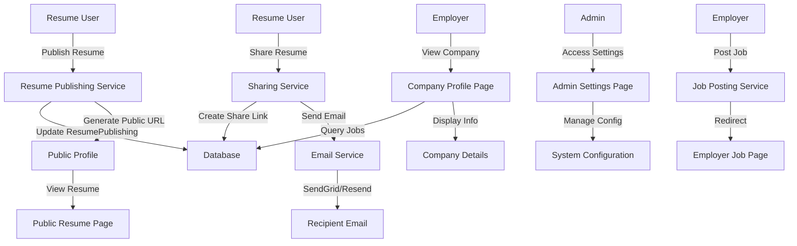

# Design Document: High-Priority App Features Fix

## Overview

This design addresses four high-priority issues in the Finbers Link application that are blocking important user workflows. The fixes involve implementing resume publishing with public profile URLs, completing email sending for resume shares, implementing company profile pages with job listings, and fixing broken navigation links. These features are partially implemented or missing entirely, preventing users from completing critical workflows.

## Architecture



## Components and Interfaces

### 1. Resume Publishing Service

**Purpose**: Publish resumes to public profiles with shareable URLs

**Current State**: TODO comment in code, ResumePublishing model exists but not used

**Interface**:
```typescript
interface ResumePublishingService {
  publishResume(
    resumeId: string,
    userId: string
  ): Promise<PublishedResume>
  
  unpublishResume(
    resumeId: string,
    userId: string
  ): Promise<void>
  
  getPublishedResume(publicId: string): Promise<PublishedResume>
  
  recordResumeView(publicId: string, viewerInfo?: ViewerInfo): Promise<void>
}
```

**Key Changes**:
- Implement publishResume() to update ResumePublishing.published flag
- Generate unique publicId for public access
- Create public resume view page at `/public/resumes/[publicId]`
- Track view count and last viewed timestamp
- Allow unpublishing to make resume private again

### 2. Email Sharing Service (Complete Implementation)

**Purpose**: Send resume share links to recipients via email

**Current State**: Share links created but emails never sent (TODO comment)

**Interface**:
```typescript
interface EmailSharingService {
  sendShareInvitationEmail(
    shareLink: ResumeShareLink,
    recipientEmail: string,
    senderName: string,
    message?: string
  ): Promise<void>
  
  sendShareReminderEmail(
    shareLink: ResumeShareLink,
    recipientEmail: string,
    senderName: string
  ): Promise<void>
  
  recordEmailSent(shareLink: ResumeShareLink): Promise<void>
}
```

**Key Changes**:
- Implement email sending after share link creation
- Use existing SendGrid/Resend infrastructure
- Include share link in email body with expiration info
- Add emailSentAt field to ResumeShareLink model
- Handle email service failures gracefully

### 3. Company Profile Pages

**Purpose**: Display company information, jobs, and statistics

**Current State**: Route exists but implementation incomplete (getCompanyJobs and getCompanyStats have empty parameters)

**Interface**:
```typescript
interface CompanyProfileService {
  getCompanyBySlug(slug: string): Promise<Company>
  
  getCompanyJobs(companyId: string): Promise<JobOpportunity[]>
  
  getCompanyStats(companyId: string): Promise<CompanyStats>
  
  recordCompanyView(companyId: string): Promise<void>
}
```

**Key Changes**:
- Link JobOpportunity to Company via companyId field
- Implement getCompanyJobs to query jobs by company
- Implement getCompanyStats to calculate active jobs, applications, views
- Add viewCount to Company model
- Display company logo, description, industry, location, website
- Show active job postings with application counts
- Display company statistics (jobs, applications, views)

### 4. Admin Settings Page

**Purpose**: Consolidate system configuration and admin settings

**Current State**: `/admin/settings` link broken, no page exists

**Interface**:
```typescript
interface AdminSettingsService {
  getSystemSettings(): Promise<SystemSettings>
  
  updateSystemSettings(settings: Partial<SystemSettings>): Promise<void>
  
  getAdminStats(): Promise<AdminStats>
}
```

**Key Changes**:
- Create `/app/admin/settings/page.tsx`
- Display system configuration options
- Show admin statistics (users, jobs, applications, resumes)
- Allow configuration of email settings, rate limits, feature flags
- Require ADMIN role for access

### 5. Employer Job Posting Workflow

**Purpose**: Separate employer job posting from admin interface

**Current State**: `/jobs/post` redirects to `/admin/jobs`, no employer-specific page

**Interface**:
```typescript
interface EmployerJobPostingService {
  createJobPosting(
    employerId: string,
    jobData: CreateJobInput
  ): Promise<JobOpportunity>
  
  updateJobPosting(
    jobId: string,
    employerId: string,
    jobData: UpdateJobInput
  ): Promise<JobOpportunity>
  
  getEmployerJobs(employerId: string): Promise<JobOpportunity[]>
}
```

**Key Changes**:
- Create `/app/employer/jobs/page.tsx` to list employer's jobs
- Create `/app/employer/jobs/new/page.tsx` for job posting form
- Create `/app/employer/jobs/[jobId]/edit/page.tsx` for editing
- Redirect `/jobs/post` to `/employer/jobs/new`
- Ensure employer can only manage their own jobs
- Reuse job posting form component from admin interface

## Data Models

### ResumePublishing (Existing - needs implementation)
```typescript
model ResumePublishing {
  id                  String    @id @default(cuid())
  resumeId            String    @unique
  publicId            String    @unique
  published           Boolean   @default(false)
  publishedAt         DateTime?
  unpublishedAt       DateTime?
  viewCount           Int       @default(0)
  lastViewedAt        DateTime?
  createdAt           DateTime  @default(now())
  updatedAt           DateTime  @updatedAt
  resume              Resume    @relation("Publishing", fields: [resumeId], references: [id])
}
```

### ResumeShareLink (Existing - needs emailSentAt field)
```typescript
model ResumeShareLink {
  id                String    @id @default(cuid())
  resumeId          String
  shareToken        String    @unique
  recipientEmail    String?
  senderId          String
  createdAt         DateTime  @default(now())
  expiresAt         DateTime
  revokedAt         DateTime?
  emailSentAt       DateTime?  // NEW: Track when email was sent
  viewCount         Int       @default(0)
  lastViewedAt      DateTime?
  resume            Resume    @relation("ShareLinks", fields: [resumeId], references: [id])
  sender            User      @relation("SentShareLinks", fields: [senderId], references: [id])
}
```

### Company (Existing - needs companyId in JobOpportunity)
```typescript
model Company {
  id          String   @id @default(cuid())
  slug        String   @unique
  name        String
  description String?
  website     String?
  logo        String?
  size        String?
  industry    String?
  location    String?
  postedById  String?
  viewCount   Int      @default(0)  // NEW: Track profile views
  createdAt   DateTime @default(now())
  updatedAt   DateTime @updatedAt
  postedBy    User?    @relation("CompanyPostedBy", fields: [postedById], references: [id])
}
```

### JobOpportunity (Existing - needs companyId field)
```typescript
model JobOpportunity {
  // ... existing fields ...
  companyId         String?  // NEW: Link to company
  company           Company? @relation(fields: [companyId], references: [id])
}
```

## Algorithmic Pseudocode

### Resume Publishing Algorithm

```pascal
ALGORITHM publishResume(resumeId, userId)
INPUT: resumeId (String), userId (String)
OUTPUT: publishedResume (PublishedResume)

BEGIN
  // Step 1: Verify resume ownership
  resume ← database.getResume(resumeId)
  ASSERT resume IS NOT NULL
  ASSERT resume.userId = userId
  
  // Step 2: Check if already published
  publishing ← database.getResumePublishing(resumeId)
  
  IF publishing IS NULL THEN
    // Create new publishing record
    publicId ← generateUniquePublicId()
    publishing ← database.createResumePublishing({
      resumeId: resumeId,
      publicId: publicId,
      published: true,
      publishedAt: now()
    })
  ELSE
    // Update existing record
    publishing.published ← true
    publishing.publishedAt ← now()
    database.updateResumePublishing(publishing)
  END IF
  
  // Step 3: Update resume visibility
  resume.visibility ← 'PUBLIC'
  database.updateResume(resume)
  
  // Step 4: Generate public URL
  publicUrl ← '/public/resumes/' + publishing.publicId
  
  RETURN {
    resumeId: resumeId,
    publicId: publishing.publicId,
    publicUrl: publicUrl,
    publishedAt: publishing.publishedAt
  }
END
```

**Preconditions**:
- resumeId is valid and exists
- userId matches resume owner
- Resume has required fields (title, summary)

**Postconditions**:
- ResumePublishing record created or updated
- published flag set to true
- publishedAt timestamp set
- Resume visibility changed to PUBLIC
- Public URL generated

### Email Sharing Algorithm

```pascal
ALGORITHM sendShareEmails(resumeId, recipients, message)
INPUT: resumeId (String), recipients (String[]), message (String)
OUTPUT: emailsSent (Integer)

BEGIN
  // Step 1: Validate inputs
  ASSERT resumeId IS NOT NULL
  ASSERT recipients.length > 0 AND recipients.length <= 50
  
  // Step 2: Fetch resume and user
  resume ← database.getResume(resumeId)
  user ← database.getUser(resume.userId)
  ASSERT resume IS NOT NULL AND user IS NOT NULL
  
  // Step 3: Initialize counter
  emailsSent ← 0
  
  // Step 4: Process each recipient
  FOR EACH email IN recipients DO
    TRY
      // Get or create share link
      shareLink ← database.getOrCreateShareLink(resumeId, email)
      ASSERT shareLink IS NOT NULL
      
      // Build email content
      shareUrl ← buildShareUrl(shareLink.shareToken)
      emailBody ← renderEmailTemplate({
        senderName: user.firstName + ' ' + user.lastName,
        resumeTitle: resume.title,
        shareUrl: shareUrl,
        expiresAt: shareLink.expiresAt,
        message: message
      })
      
      // Send email
      sendEmail({
        to: email,
        subject: user.firstName + ' shared their resume with you',
        html: emailBody,
        from: 'noreply@finbers-link.com'
      })
      
      // Update share link with email sent timestamp
      shareLink.emailSentAt ← now()
      database.updateShareLink(shareLink)
      
      emailsSent ← emailsSent + 1
      
    CATCH error
      logError('Failed to send email to ' + email, error)
      // Continue with next recipient
    END TRY
  END FOR
  
  RETURN emailsSent
END
```

**Preconditions**:
- resumeId is valid and belongs to authenticated user
- recipients array contains valid email addresses
- Email service is configured (SendGrid or Resend)

**Postconditions**:
- Share links created for all recipients
- Emails sent to all valid recipients
- Share link records updated with emailSentAt timestamp
- Errors logged but don't block other recipients

### Company Profile Loading Algorithm

```pascal
ALGORITHM loadCompanyProfile(slug)
INPUT: slug (String)
OUTPUT: companyProfile (CompanyProfile)

BEGIN
  // Step 1: Fetch company by slug
  company ← database.getCompanyBySlug(slug)
  ASSERT company IS NOT NULL
  
  // Step 2: Fetch company jobs
  jobs ← database.getJobsByCompanyId(company.id)
  
  // Step 3: Calculate company statistics
  stats ← {
    jobCount: jobs.length,
    applicationCount: sumApplications(jobs),
    totalViews: company.viewCount
  }
  
  // Step 4: Record view
  recordCompanyView(company.id)
  
  // Step 5: Build profile response
  profile ← {
    company: company,
    jobs: jobs,
    stats: stats
  }
  
  RETURN profile
END
```

**Preconditions**:
- slug is valid and exists in database
- Company has associated jobs

**Postconditions**:
- Company data retrieved
- Jobs list populated
- Statistics calculated
- View count incremented
- Profile data returned

## Key Functions with Formal Specifications

### Function 1: publishResume()

```typescript
async function publishResume(
  resumeId: string,
  userId: string
): Promise<PublishedResume>
```

**Preconditions**:
- `resumeId` is a valid CUID and exists in database
- `userId` matches resume owner
- Resume has title and summary (required fields)

**Postconditions**:
- ResumePublishing record created or updated
- `published` flag set to true
- `publishedAt` timestamp set to current time
- Resume visibility changed to PUBLIC
- Returns object with publicId and publicUrl
- No side effects on resume content

**Loop Invariants**: N/A

### Function 2: sendShareInvitationEmail()

```typescript
async function sendShareInvitationEmail(
  shareLink: ResumeShareLink,
  recipientEmail: string,
  senderName: string,
  message?: string
): Promise<void>
```

**Preconditions**:
- `shareLink` is valid and not expired
- `recipientEmail` is valid email format
- `senderName` is non-empty string
- Email service is configured

**Postconditions**:
- Email sent successfully to recipient
- Share link marked with emailSentAt timestamp
- Email contains valid share URL and expiration date
- No exceptions thrown (errors logged)

**Loop Invariants**: N/A

### Function 3: getCompanyProfile()

```typescript
async function getCompanyProfile(
  slug: string
): Promise<CompanyProfile>
```

**Preconditions**:
- `slug` is valid and exists in database
- Company has associated jobs

**Postconditions**:
- Returns company data with all fields
- Returns array of active jobs for company
- Returns calculated statistics (job count, application count, views)
- Company view count incremented
- No side effects on company data

**Loop Invariants**: N/A

### Function 4: createEmployerJobPosting()

```typescript
async function createEmployerJobPosting(
  employerId: string,
  jobData: CreateJobInput
): Promise<JobOpportunity>
```

**Preconditions**:
- `employerId` is valid and user has EMPLOYER role
- `jobData` contains required fields (title, company, location, description)
- `jobData.companyId` matches employer's company

**Postconditions**:
- JobOpportunity created with postedById set to employerId
- companyId set to employer's company
- Job is active and visible
- Returns created job with all fields
- No side effects on other jobs

**Loop Invariants**: N/A

## Example Usage

### Resume Publishing
```typescript
// User clicks "Publish Resume" button
const published = await publishResume(resumeId, userId);

// Response:
// {
//   resumeId: "abc123",
//   publicId: "xyz789",
//   publicUrl: "/public/resumes/xyz789",
//   publishedAt: "2024-01-15T10:30:00Z"
// }

// User can share public URL: https://finbers-link.com/public/resumes/xyz789
```

### Resume Sharing with Email
```typescript
// User shares resume with recipients
const response = await fetch(`/api/resumes/${resumeId}/share`, {
  method: 'POST',
  body: JSON.stringify({
    recipients: ['recipient1@example.com', 'recipient2@example.com'],
    expirationDays: 7,
    message: 'Check out my resume!'
  })
});

// Emails are sent to recipients with share links
// Recipients receive email with link to view resume
```

### Company Profile Access
```typescript
// User navigates to /companies/tech-corp
// Page loads company profile with:
// - Company logo, name, description
// - Industry, location, website
// - Active job postings
// - Statistics (jobs, applications, views)
```

### Employer Job Posting
```typescript
// Employer navigates to /employer/jobs/new
// Fills out job posting form
// Job is created with postedById = employerId
// Employer can view all their jobs at /employer/jobs
// Employer can edit jobs at /employer/jobs/[jobId]/edit
```

### Admin Settings Access
```typescript
// Admin navigates to /admin/settings
// Page displays:
// - System configuration options
// - Admin statistics (users, jobs, applications, resumes)
// - Email settings
// - Rate limit configuration
// - Feature flags
```

## Correctness Properties

*A property is a characteristic or behavior that should hold true across all valid executions of a system—essentially, a formal statement about what the system should do. Properties serve as the bridge between human-readable specifications and machine-verifiable correctness guarantees.*

### Property 1: Resume Publishing Idempotency

*For any* resume, publishing it multiple times SHALL result in the same publicId and publicUrl.

**Validates: Requirements 1.4**

### Property 2: Resume Visibility Consistency

*For any* published resume, the visibility field SHALL be PUBLIC and the published flag SHALL be true.

**Validates: Requirements 1.3, 6.1**

### Property 3: Public Resume Access

*For any* published resume, accessing the public URL SHALL display the resume content without authentication.

**Validates: Requirements 1.5, 9.7**

### Property 4: Resume Unpublishing

*For any* unpublished resume, accessing the public URL SHALL return 404 Not Found.

**Validates: Requirements 1.10**

### Property 5: Share Link Email Delivery

*For any* share link creation, sending an invitation email SHALL update the emailSentAt timestamp and include the share URL in the email body.

**Validates: Requirements 2.1, 2.2, 2.3, 7.3**

### Property 6: Share Link Expiration

*For any* share link where the current time exceeds the expiration date, accessing the link SHALL return 404 error.

**Validates: Requirements 2.9**

### Property 7: Email Sending Resilience

*For any* email sending failure, the system SHALL retry up to 3 times with exponential backoff before logging the failure.

**Validates: Requirements 2.5, 12.3**

### Property 8: Company Profile Completeness

*For any* company, the profile page SHALL display company info, active jobs, and statistics.

**Validates: Requirements 3.1, 3.2, 3.3, 8.1**

### Property 9: Company Job Listing

*For any* company, the jobs list SHALL only include active jobs posted by that company.

**Validates: Requirements 3.4, 8.3**

### Property 10: Company Statistics Accuracy

*For any* company, the statistics SHALL accurately reflect the number of active jobs, total applications, and profile views.

**Validates: Requirements 3.9, 8.5**

### Property 11: Admin Settings Access Control

*For any* access to /admin/settings, the system SHALL verify the user has ADMIN role before granting access.

**Validates: Requirements 4.2, 4.7, 9.5**

### Property 12: Employer Job Posting Authorization

*For any* employer attempting to create a job, the system SHALL verify they have EMPLOYER role before allowing creation.

**Validates: Requirements 5.4, 9.3**

### Property 13: Employer Job Ownership

*For any* employer attempting to edit a job, the system SHALL verify they own the job before allowing modifications.

**Validates: Requirements 5.6, 9.4**

### Property 14: Resume Publishing Authorization

*For any* resume publishing request, the system SHALL verify the user owns the resume before publishing.

**Validates: Requirements 1.6, 9.1**

### Property 15: Share Link Authorization

*For any* resume sharing request, the system SHALL verify the user owns the resume before creating share links.

**Validates: Requirements 2.6, 9.2**

### Property 16: Resume Publishing Performance

*For any* resume publishing request, the operation SHALL complete within 1 second.

**Validates: Requirements 1.7, 10.1**

### Property 17: Email Sending Performance

*For any* email sending operation, the operation SHALL complete within 5 seconds.

**Validates: Requirements 2.7, 10.2**

### Property 18: Company Profile Loading Performance

*For any* company profile page load, the operation SHALL complete within 2 seconds.

**Validates: Requirements 3.7, 10.3**

### Property 19: Resume Publishing Atomicity

*For any* resume publishing operation, the ResumePublishing record creation and Resume visibility update SHALL occur atomically.

**Validates: Requirements 6.6, 11.1**

### Property 20: Share Link Token Uniqueness

*For any* share link, the shareToken SHALL be unique and not reusable.

**Validates: Requirements 2.8, 7.2, 11.2**

### Property 21: Company View Count Accuracy

*For any* company profile view, the viewCount SHALL be incremented by exactly 1.

**Validates: Requirements 3.5, 8.2, 11.3**

### Property 22: Resume Data Immutability

*For any* resume publishing operation, the underlying resume data SHALL remain unchanged.

**Validates: Requirements 11.4**

### Property 23: Job Posting Immutability

*For any* job posting, the postedById field SHALL be immutable after creation.

**Validates: Requirements 5.9, 11.5**

### Property 24: Resume Publishing Record Creation

*For any* published resume, a ResumePublishing record SHALL be created with all required fields (resumeId, publicId, published, publishedAt).

**Validates: Requirements 1.1, 6.1**

### Property 25: Public ID Uniqueness

*For any* published resume, the publicId SHALL be unique across all published resumes.

**Validates: Requirements 6.2**

### Property 26: Timestamp Format Compliance

*For any* resume publishing operation, the publishedAt timestamp SHALL be stored in ISO 8601 format.

**Validates: Requirements 6.3**

### Property 27: Resume View Tracking

*For any* resume view, the viewCount SHALL be incremented by 1 and lastViewedAt SHALL be updated.

**Validates: Requirements 6.5**

### Property 28: Share Link View Tracking

*For any* share link access, the viewCount SHALL be incremented by 1 and lastViewedAt SHALL be updated.

**Validates: Requirements 7.4**

### Property 29: Share Link Revocation

*For any* revoked share link, the revokedAt timestamp SHALL be set and further access SHALL be prevented.

**Validates: Requirements 7.5, 13.7**

### Property 30: Company Job Linking

*For any* JobOpportunity created, it SHALL be linked to a company via the companyId field.

**Validates: Requirements 5.10, 8.4**

### Property 31: Batch Email Sending

*For any* batch of share invitations, emails SHALL be sent to all recipients and the count of successfully sent emails SHALL be returned.

**Validates: Requirements 2.4**

### Property 32: Invalid Email Handling

*For any* batch of recipients containing invalid email addresses, the system SHALL skip invalid emails and continue processing valid ones.

**Validates: Requirements 2.10, 14.4**

### Property 33: Custom Message Inclusion

*For any* share invitation with a custom message, the message SHALL be included in the email body.

**Validates: Requirements 2.11**

### Property 34: Email Format Validation

*For any* email sending operation, the system SHALL validate email format before attempting to send.

**Validates: Requirements 2.12, 12.7**

### Property 35: Employer Job Listing

*For any* employer, the system SHALL display only jobs posted by that employer.

**Validates: Requirements 5.1**

### Property 36: Job Creation with Company Link

*For any* job created by an employer, the system SHALL set postedById to the employer's ID and companyId to the employer's company.

**Validates: Requirements 5.3**

### Property 37: Job Update Persistence

*For any* job update by an employer, the changes SHALL be persisted to the database.

**Validates: Requirements 5.7**

### Property 38: Email Service Integration

*For any* email sending operation, the system SHALL use the configured email service (SendGrid or Resend).

**Validates: Requirements 12.1**

### Property 39: Error Logging

*For any* email sending failure, the system SHALL log the error with details for debugging.

**Validates: Requirements 12.2, 17.3**

### Property 40: Email Content Completeness

*For any* email sent, it SHALL include the sender's name, resume title, share URL, and expiration date.

**Validates: Requirements 12.4**

### Property 41: Email From Address

*For any* email sent, the from address SHALL be 'noreply@finbers-link.com'.

**Validates: Requirements 12.5**

### Property 42: Email Rate Limiting

*For any* user, the system SHALL limit email sending to 50 emails per hour.

**Validates: Requirements 12.6**

### Property 43: Cryptographic Token Generation

*For any* share link, the shareToken SHALL be cryptographically secure.

**Validates: Requirements 13.1**

### Property 44: Sensitive Data Protection

*For any* public resume access, the system SHALL not expose sensitive user information (email, phone, address).

**Validates: Requirements 13.2**

### Property 45: Authentication and Authorization Verification

*For any* access to admin or employer routes, the system SHALL verify authentication and authorization before granting access.

**Validates: Requirements 13.3, 9.6**

### Property 46: Company Slug Validation

*For any* company slug access, the system SHALL validate the slug to prevent path traversal attacks.

**Validates: Requirements 13.4**

### Property 47: Email Address Validation

*For any* email address stored, the system SHALL validate the format before storing.

**Validates: Requirements 13.5**

### Property 48: Sensitive Data Redaction

*For any* sensitive data logged, the system SHALL encrypt or redact sensitive information in audit logs.

**Validates: Requirements 13.6**

### Property 49: Resume Publishing Logging

*For any* resume published, the system SHALL log the action with userId, resumeId, and timestamp.

**Validates: Requirements 17.1**

### Property 50: Email Sending Logging

*For any* email sent, the system SHALL log the action with recipient email, shareLink ID, and timestamp.

**Validates: Requirements 17.2**

### Property 51: Company Profile Access Logging

*For any* company profile accessed, the system SHALL log the action with company ID and timestamp.

**Validates: Requirements 17.4**

### Property 52: Job Creation Logging

*For any* job created, the system SHALL log the action with employerId, jobId, and timestamp.

**Validates: Requirements 17.5**

### Property 53: Admin Settings Update Logging

*For any* admin settings updated, the system SHALL log the action with adminId, changed fields, and timestamp.

**Validates: Requirements 17.6**

### Property 54: Model Field Defaults

*For any* new fields added to data models, the system SHALL provide default values for existing records.

**Validates: Requirements 18.4**

## Error Handling

### Error Scenario 1: Resume Not Found
**Condition**: User tries to publish non-existent resume
**Response**: Return 404 with message "Resume not found"
**Recovery**: User must select valid resume

### Error Scenario 2: Unauthorized Resume Publishing
**Condition**: User tries to publish resume they don't own
**Response**: Return 403 Forbidden
**Recovery**: User must own resume to publish

### Error Scenario 3: Email Service Unavailable
**Condition**: SendGrid/Resend API returns error
**Response**: Log error, return 500 with message "Failed to send emails"
**Recovery**: Retry failed emails, check email service status

### Error Scenario 4: Invalid Email Address
**Condition**: Share recipient email is invalid format
**Response**: Skip invalid email, continue with others
**Recovery**: User must provide valid email addresses

### Error Scenario 5: Company Not Found
**Condition**: User accesses non-existent company profile
**Response**: Return 404 Not Found
**Recovery**: User must access valid company slug

### Error Scenario 6: Unauthorized Job Posting
**Condition**: Non-employer tries to post job
**Response**: Return 403 Forbidden
**Recovery**: User must have EMPLOYER role

### Error Scenario 7: Unauthorized Admin Settings Access
**Condition**: Non-admin tries to access /admin/settings
**Response**: Return 403 Forbidden or redirect to dashboard
**Recovery**: User must have ADMIN role

## Testing Strategy

### Unit Testing Approach
- Test resume publishing with valid/invalid resume IDs
- Test email sending with mock email service
- Test company profile loading with various company states
- Test authorization checks for employer routes
- Test share link expiration logic

### Property-Based Testing Approach
- Generate random resume data and verify publishing is idempotent
- Generate random email lists and verify all recipients get emails
- Generate random company data and verify statistics are accurate
- Generate random employer/job combinations and verify authorization

**Property Test Library**: fast-check (already in dependencies)

### Integration Testing Approach
- Test full resume publishing flow: publish → access public URL → verify content
- Test full sharing flow: create share link → send email → verify recipient receives
- Test company profile: load profile → verify jobs displayed → verify stats accurate
- Test employer job posting: create job → verify in employer list → verify in company profile

## Performance Considerations

- Cache company profiles to avoid repeated database queries
- Index JobOpportunity by companyId for fast job lookups
- Implement pagination for company job listings (20 per page)
- Cache ResumePublishing records to avoid repeated lookups
- Use database transactions for atomic operations
- Implement rate limiting for email sending (50 per hour per user)

## Security Considerations

- Verify user owns resume before publishing
- Verify user owns job before editing
- Verify user has ADMIN role for settings access
- Verify user has EMPLOYER role for job posting
- Sanitize share link tokens to prevent injection
- Validate email addresses before sending
- Rate limit email sending to prevent abuse
- Encrypt sensitive data in audit logs
- Validate company slug to prevent path traversal

## Dependencies

- **SendGrid**: API key in environment (SENDGRID_API_KEY)
- **Resend**: API key in environment (RESEND_API_KEY)
- **Prisma**: Already configured for database operations
- **Next.js**: Already configured for routing and API endpoints
- **Zod**: Already in package.json for validation
- **Lucide React**: Already in package.json for icons

